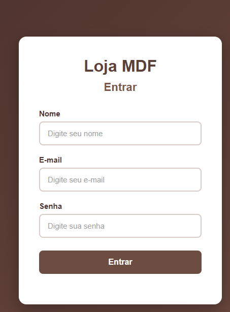
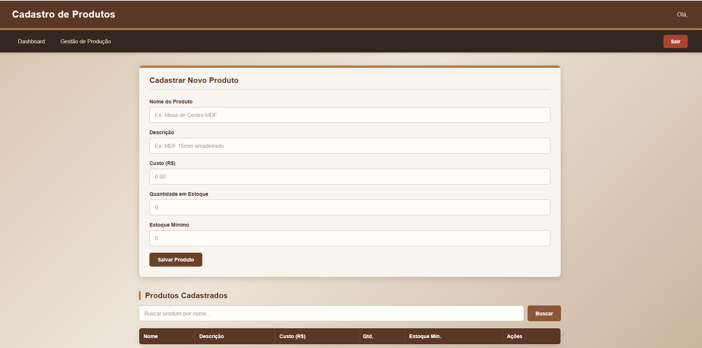
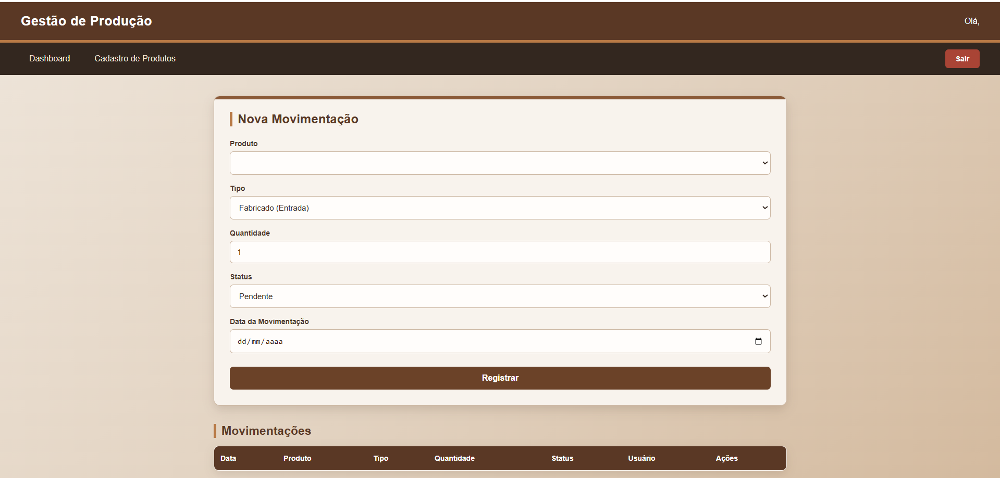
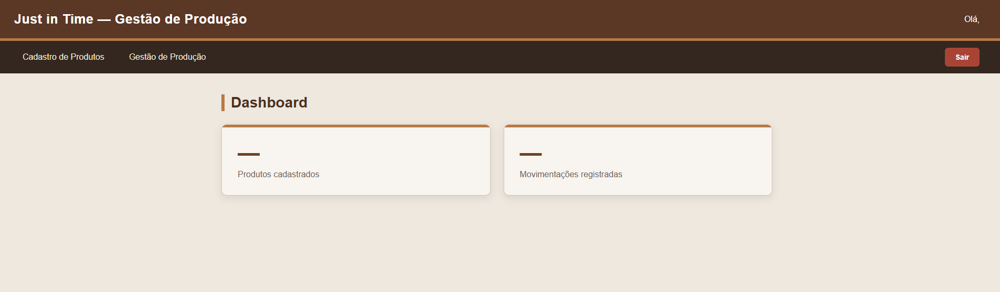

# Just In Time

O objetivo é fazer um site just in time para uma empresa de MDF que necessita de estoque minimo para otimizar o tempo e produzir conforme a demanda da pessoas e para diminuir o desperdicios.

### Capturas de Tela

### Login

  

### Cadastro de Produtos  

  &nbsp;&nbsp;&nbsp;&nbsp;
  

### Gestão de Produção  

  &nbsp;&nbsp;&nbsp;&nbsp;
  

### Dashboard 

  &nbsp;&nbsp;&nbsp;&nbsp;
  

## Funcionalidades e não funcionalidades
* **Frontend:** Telas prontas, so não tem o script feito, por conta que tenho dificuldade no script.

* **Design Responsivo:** Interface limpa e temática na cor de MDF , perfeita para acompanhamento diário no PC ou Celular.

* **Backend:** Esta pronto so não ta funcionando.

## Tecnologias Utilizadas

* HTML5
* CSS3
* JavaScript (Vanilla)

## Como Executar

1. Clone ou baixe o repositório.
2. Abra o arquivo `index.html` no seu navegador favorito.
3. Clique em "Entrar" na tela de splash para começar a registrar seu consumo de água.